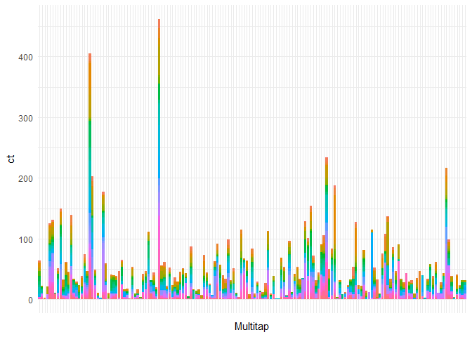

Ontap
================
Wojciech Supko
4 lutego 2018

``` r
ggplot(Imp.All[, .(ct = .N), .(Date = as.Date(Podlaczenie))]) + 
    geom_bar(aes(x = Date, y = ct), stat = 'identity') + 
    theme_minimal() + theme(legend.position = 'none')
```


