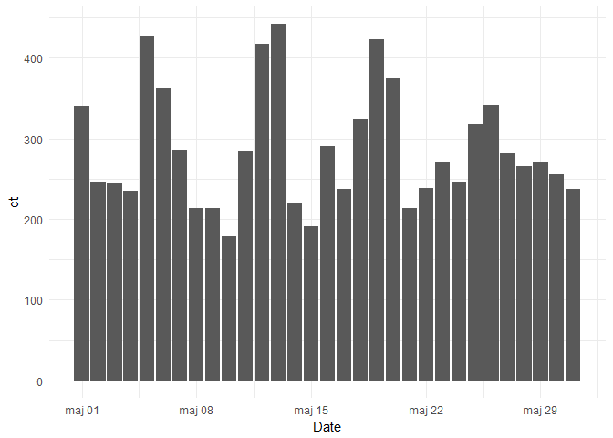

Ontap
================
Wojciech Supko
4 lutego 2018

``` r
ggplot(Imp.All[, .(ct = .N), .(Multitap, Browar)]) + 
    geom_bar(aes(x = Multitap, y = ct, fill = Browar), stat = 'identity') + 
    theme_minimal() + theme(legend.position = 'none', axis.text.x = element_blank())
```


